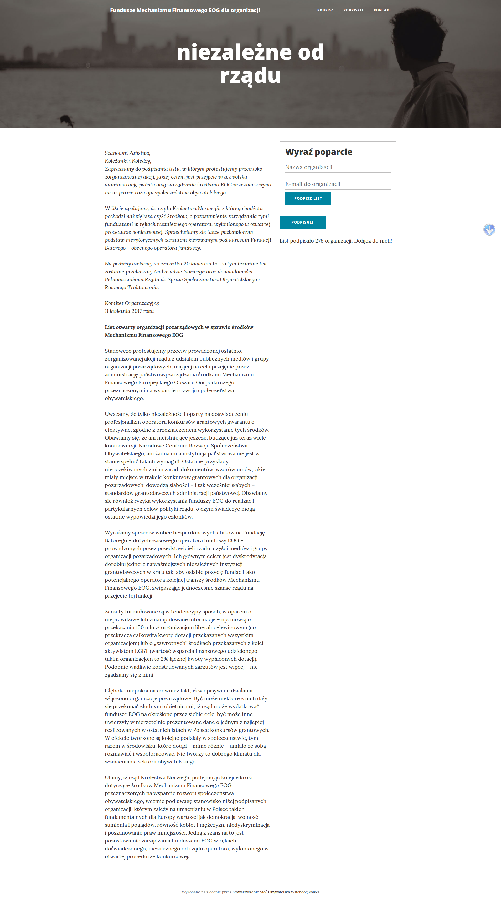

.. _themes:

*****************
Szablony (themes)
*****************

Założenia
#########

Komponent określa szablony i ich parametry, które są możliwe podczas konfiguracji kampanii.

Szczególną rolę pełni pole ``Theme.prefix``, gdyż określa dopuszczalne wartości.

Każdy szablon winien zapewniać następujące pliki szablonów Django::

    $ find $(find -type d -name 'norweskie') -type f
    ./petycja_norweskie/templates/norweskie/base.html
    ./petycja_norweskie/petitions/templates/petitions/norweskie/field_custom.html
    ./petycja_norweskie/petitions/templates/petitions/norweskie/signature_form.html
    ./petycja_norweskie/petitions/templates/petitions/norweskie/signature_list.html
    ./petycja_norweskie/petitions/templates/petitions/norweskie/petition_success.html
    ./petycja_norweskie/petitions/templates/petitions/norweskie/petition_detail.html

W wskazanym przykładzie 'norweskie' stanowi odpowiedni prefix.

Dostępne szablony
#################

norweskie.org
-------------

.. _add_theme:

Dodawanie szablonu
##################

W przypadku dodania nowego szablonu należy wykonać::

    python manage.py makemigrations themes --empty --name "add theme {{prefix}}"

W nowoutworzonym pliku wstawić treść zgodnie z szablonem::

    # -*- coding: utf-8 -*-
    from __future__ import unicode_literals

    from django.db import migrations

    def update_theme_forward(apps, schema_editor):
        Theme = apps.get_model('themes', 'Theme')
        Theme.objects.update_or_create(
            prefix="norweskie",
            defaults={
                'name': 'Niezależne fundusze norweskie',
                'description': '',
                'authorship': 'Kamil Breguła (mik-laj)'
            }
        )

    class Migration(migrations.Migration):
        dependencies = [
            ('themes', '0001_initial'),
        ]

        operations =
        migrations.RunPython(update_theme_forward)
    ]

Warto także w niniejszej dokumentacji zamieścić podgląd.

Architektura
############

Model
-----

.. automodule:: petycja_norweskie.themes.models
   :members:

Panel administracyjny
---------------------

.. automodule:: petycja_norweskie.themes.admin
   :members:

Widoki
------

.. automodule:: petycja_norweskie.themes.views
   :members:
